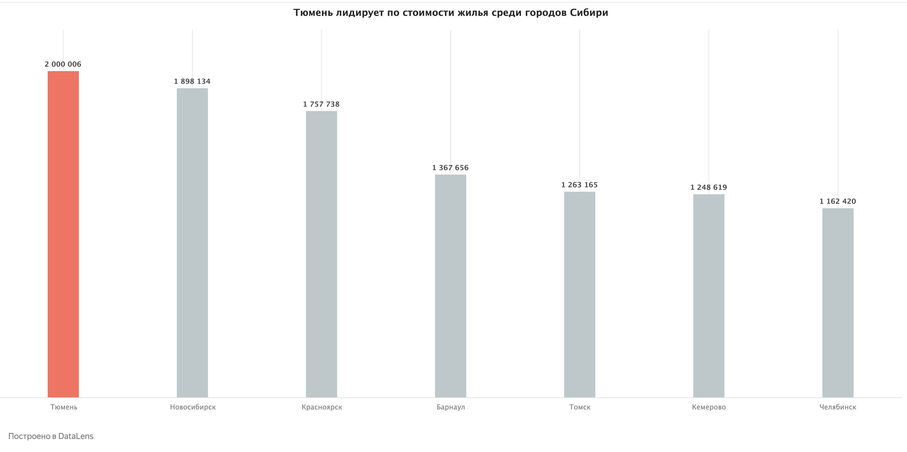
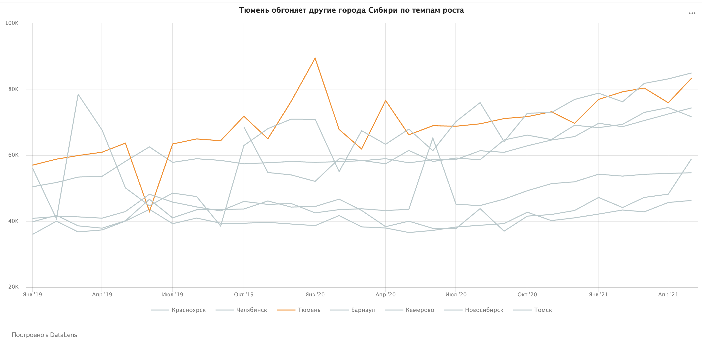
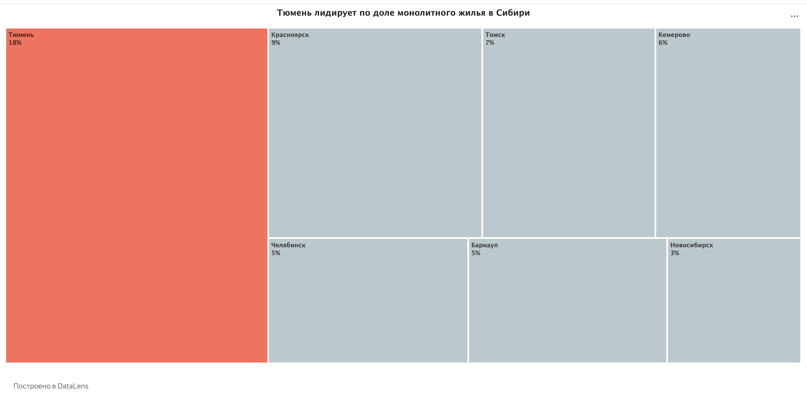
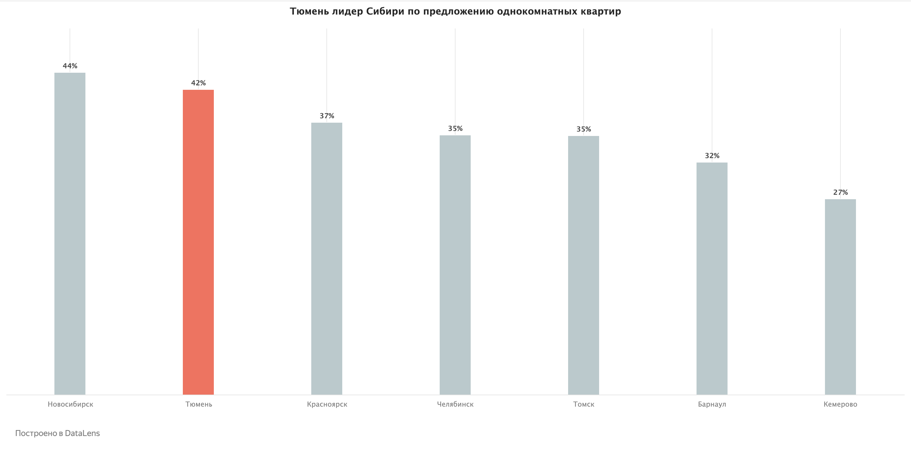

#  Siberia Real Estate Market Analysis (DataLens)

This project focuses on identifying market trends across major Siberian cities (2019-2021), highlighting **Tyumen's** leadership in price growth and construction quality.

---

## 📂 Project Structure
* [**Charts/**](./Charts/) — Analytical visualizations and screenshots.
* [**Datasets/**](./Datasets/) — Raw XLSX files used for the analysis.

---

## 📈 Key Visualizations

#### 1. Price Benchmark (Tyumen vs Siberia)

#### 2. Market Dynamics (2019-2021)

#### 3. Construction Quality: Monolithic Dominance

#### 4. Liquidity Analysis: 1-Room Inventory

---

## 🔗 Live Interactive Dashboards (Yandex DataLens)
You can explore the live data and apply filters using these official links:

1. 💰 [**Average Price per SQM Comparison**](https://datalens.yandex/eh9kydpzov3sy)
   *Compare real estate prices across major Siberian cities.*

2. 📈 [**Price Growth Dynamics (2019-2021)**](https://datalens.yandex/be61d1ih9rpev)
   *Detailed 3-year market trend analysis.*

3. 🏢 [**Housing Type Distribution**](https://datalens.yandex/svnkjrxt3ck0c)
   *Comprehensive breakdown of building materials (Panel, Brick, Block).*

4. 🏗️ [**Monolithic Share: Regional Leaderboard**](https://datalens.yandex/jmefdv2w0yii3)
   *TreeMap visualization of high-quality modern housing.*

5. 🚪 [**1-Room Apartment Market Liquidity**](https://datalens.yandex/pskqpfuc7gay9)
   *Analysis of the most popular apartment type in Tyumen.*

## 👤 Author
**Alibek** — *Data Analytics Portfolio*
